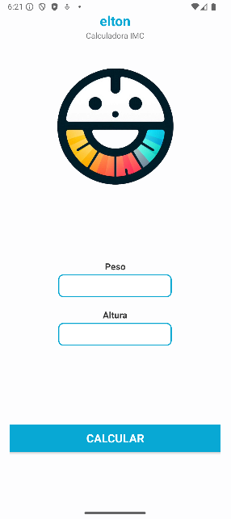
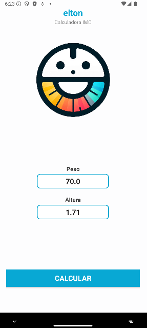

# Elton

**Um aplicativo simples para calcular Índice de Massa Corporal (IMC).**

## Linguagens e Tecnologias
- Kotlin
- Gradle


## Rodando
1. Clone o repositório:
   <br> ```git clone git@github.com:aa-abnerandrade/elton_AplicativoIMC.git```
2. Abra o diretório em sua IDE. No terminal integrado, execute:
   <br>```./gradlew clean install build```
4. Execute a aplicação:
   <br> ```./gradlew run```


## Screenhot




## Autoria

**Abner Andrade**
<br>_Graduando em Análise e Desenvolvimento de Sistemas, apaixonado por desenvolvimento e eterno aprendiz._

👋🏽 Me encontre nas redes:
<div style="display: flex">
<a href = "https://www.linkedin.com/in/abnerandrade/"></a>
<a href = "https://api.whatsapp.com/send?phone=5521973257039&text=Oi,%20Abner.%20Curti%20tua%20Calculadora%20IMC.%20%20Vamos%20trabalhar%20juntos?"></a>
</div>